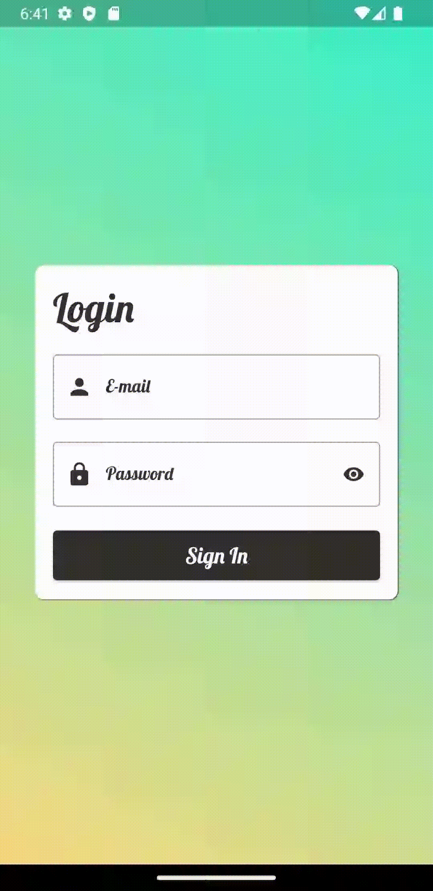

# Tela de login in flutter 

<h3 align="center">Tecnologias utilizadas e plataformas suportadas</h3>

## Descrição
Este projeto mostra a validação de campos TextFormField utilizando o widget Form. Basicamente, ele utiliza uma chave global que verifica o estado de cada validador presente nos TextFormFields. Desta forma, a função que realiza a validação recebe o valor presente no TextFormField por meio dessa chave e é possível especificar "erros" retornando strings, como por exemplo se o campo foi preenchido ou não. Caso o campo seja preenchido de forma correta, o retorno é null caso contrário, é retornado uma string com o aviso de falha.

## Funcionalidade

